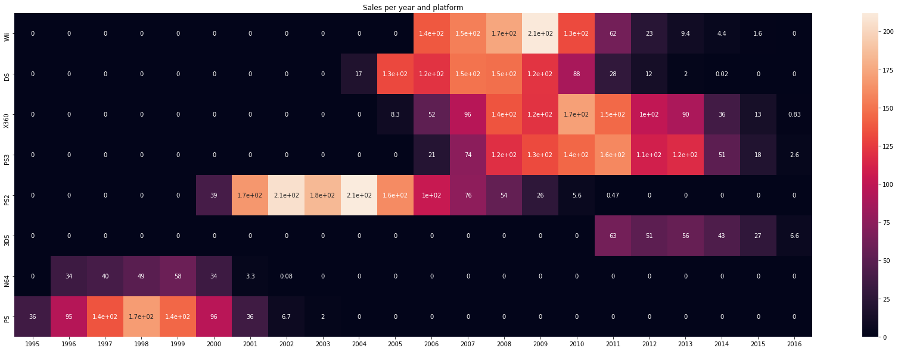

# Bar chart and heatmaps

## Heatmap

Este tipo de gráfico, mapa de calor, es muy útil a la hora de comparar valores
numéricos de una relación. Es decir, si por ejemplo tenemos las ventas de
videojuegos clasificadas por plataforma y año como se muestra a continuación

| Plataforma | Año  | Ventas |
--- | --- | ---
|Wii|2000|100|
|Wii|2001|150|
|Wii|2002|50|
|DS|2000|98|
|DS|2001|118|
|DS|2002|134|

Si esta tabla de datos fuera mucho mayor con cientos de miles de entradas sería
bastante complicado hacer una comparación de sus datos con otro tipo de gráficas.
Con el mapa de calor podremos hacer un eje de coordenadas como si de un mapa de
hundir la flota se tratase. Dónde, en los ejes en lugar de letras y números
tengamos el nombre de la plataforma y el año en el que ocurren las ventas. 

Y luego dentro de este mapa pondremos los valores que corresponda a cada
intersección. La parte interesante viene ahora, este mapa además colorea con
un degradado todas las casillas de tal manera que las que tengan un valor mayor
sea de un color más intenso y las de menor valor de un tono más claro.

Con esto lo que logramos es ver patrones más fácilmente de momentos en los que
han habido muchas ventas.

Te dejo un ejemplo a continuación

Para ello necesitaremos que los datos que los datos estén formateados de tal
manera que las cabeceras sean uno de los ejes y los índices el otro. Estos dos
son los únicos datos que pueden no ser numéricos el resto debe de serlo.

|  | 2000 | 2001 | 2002 |
--- | --- | --- | --- 
|Wii|100|250|50|
|DS|98|118|2002|
