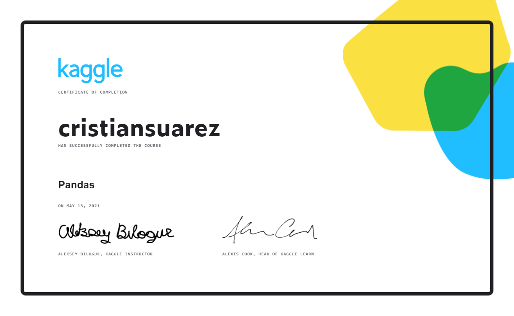

# Data Visualization

En esta sesión veremos conceptos relacionados con la manipulación de datos con 
la librería Pandas. Para ello hemos usado este módulo de Kaggle

- [Pandas][pandas]

El resultado de estos ejercicios lo hemos guardado en este mismo directorio

1. [Creating, Reading and Writing][creating-reading-and-writing]
2. [Indexing, Selecting & Assigning][indexing-selecting-and-assigning]
3. [Summary Functions and Maps][summary-functions-and-maps]
4. [Grouping and Sorting][grouping-and-sorting]
5. [Data Types and Missing Values][data-types-and-missing-values]
6. [Renaming and Combining][renaming-and-combining]

## Certificado

[][certificate]

<!-- LINKS -->
[pandas]:https://www.kaggle.com/learn/pandas
[creating-reading-and-writing]:01-creating-reading-and-writing
[indexing-selecting-and-assigning]:02-indexing-selecting-and-assigning
[summary-functions-and-maps]:03-summary-functions-and-maps
[grouping-and-sorting]:04-grouping-and-sorting
[data-types-and-missing-values]:05-data-types-and-missing-values
[renaming-and-combining]:06-renaming-and-combining
[certificate]:https://www.kaggle.com/learn/certification/cristiansuarez/pandas
