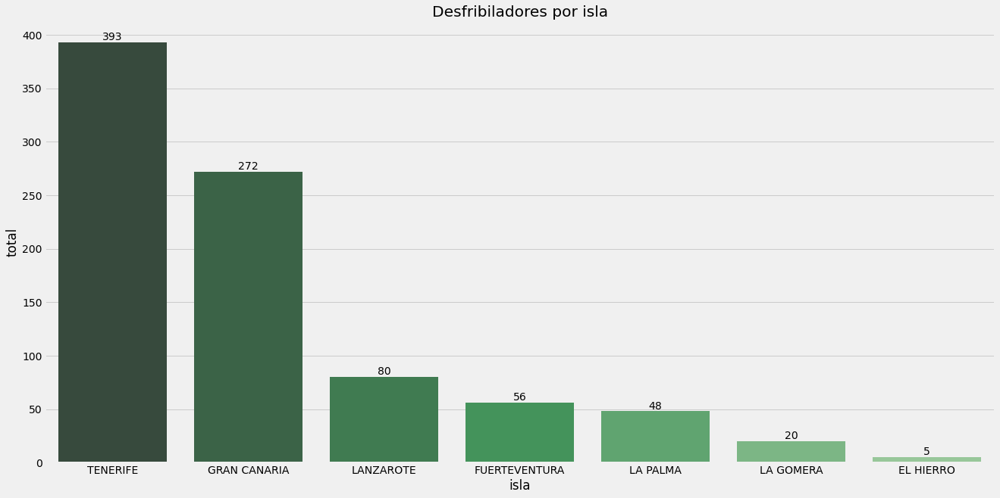
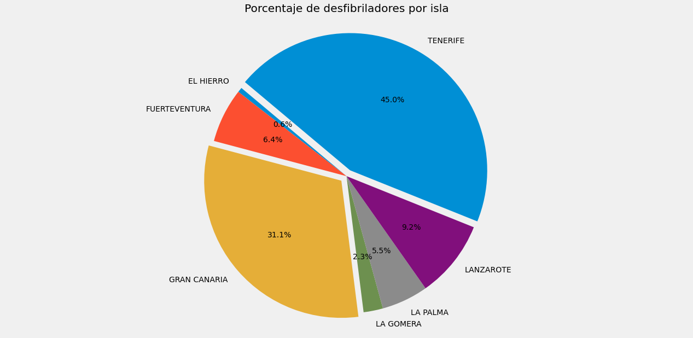
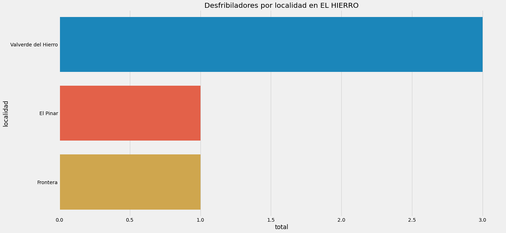
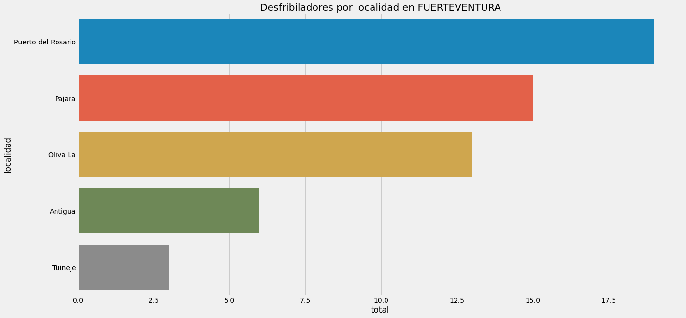
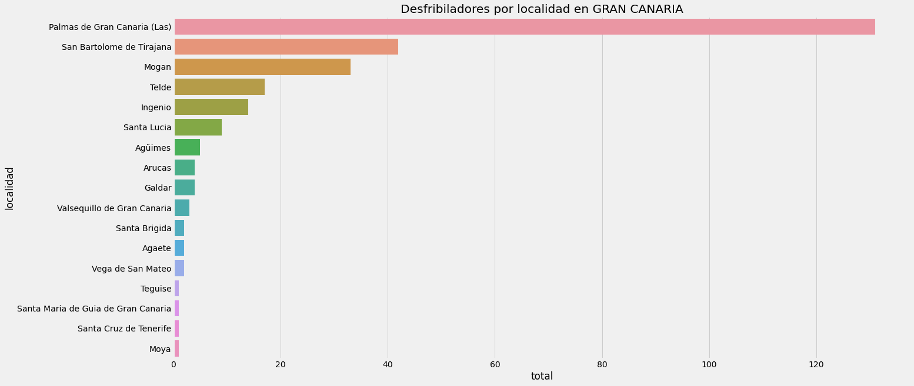
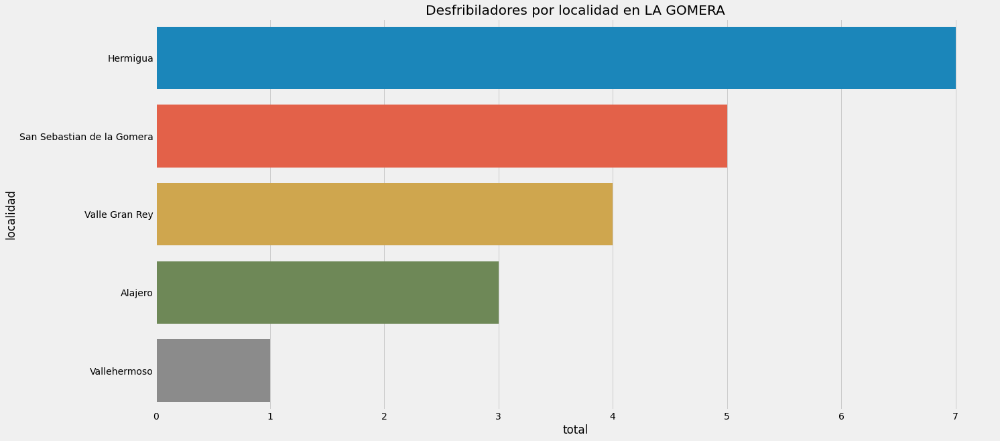
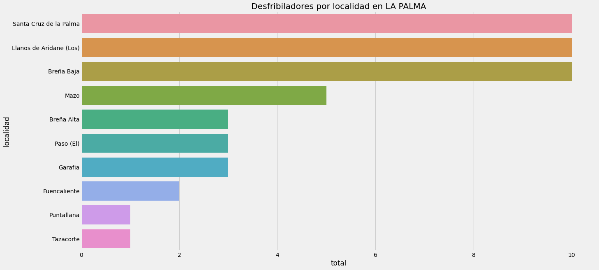
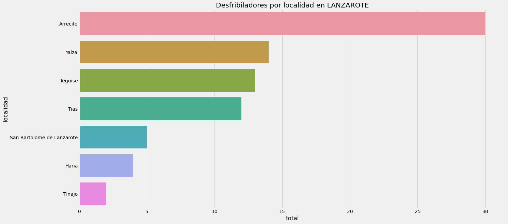
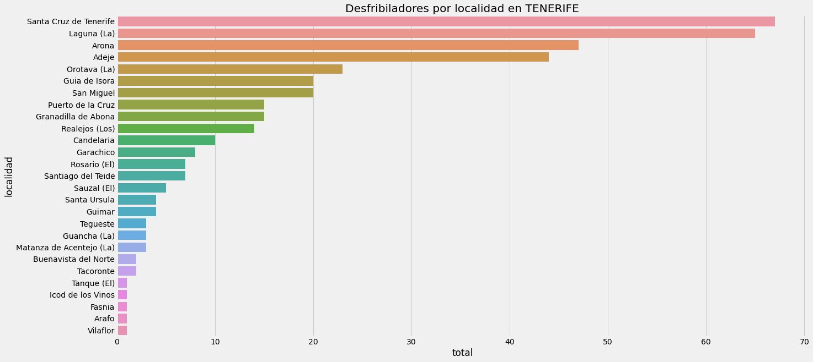

# Open data Canarias - Desfibriladores


```python
import numpy as np
import pandas as pd
import seaborn as sns
import matplotlib.pyplot as plt
plt.style.use('fivethirtyeight')

import os

for dirname, _, filenames in os.walk('./input'):
    for filename in filenames:
        print(os.path.join(dirname, filename))
```

    ./input/desfribriladores/desa.csv
    ./input/desfribriladores/.ipynb_checkpoints/desa-checkpoint.csv
    ./input/inspecciones/centros-por-zonas-de-inspeccion.csv
    ./input/inspecciones/inspector.csv
    ./input/inspecciones/zonas-de-inspeccion.csv
    ./input/inspecciones/.ipynb_checkpoints/inspector-checkpoint.csv
    ./input/meteorologia-canarias/estaciones.csv
    ./input/meteorologia-canarias/observaciones_2019.csv
    ./input/meteorologia-canarias/observaciones_2020.csv
    ./input/meteorologia-canarias/observaciones_2021.csv


```python
df = pd.read_csv('./input/desfribriladores/desa.csv', index_col='pk')
df.describe().T
```


<div>
<style scoped>
    .dataframe tbody tr th:only-of-type {
        vertical-align: middle;
    }

    .dataframe tbody tr th {
        vertical-align: top;
    }

    .dataframe thead th {
        text-align: right;
    }
</style>
<table border="1" class="dataframe">
  <thead>
    <tr style="text-align: right;">
      <th></th>
      <th>count</th>
      <th>mean</th>
      <th>std</th>
      <th>min</th>
      <th>25%</th>
      <th>50%</th>
      <th>75%</th>
      <th>max</th>
    </tr>
  </thead>
  <tbody>
    <tr>
      <th>cod_postal</th>
      <td>874.0</td>
      <td>3.696627e+04</td>
      <td>1616.987357</td>
      <td>3.500100e+04</td>
      <td>3.520900e+04</td>
      <td>3.800500e+04</td>
      <td>3.861000e+04</td>
      <td>3.891700e+04</td>
    </tr>
    <tr>
      <th>x</th>
      <td>874.0</td>
      <td>4.149945e+05</td>
      <td>108263.795463</td>
      <td>2.030620e+05</td>
      <td>3.415755e+05</td>
      <td>3.770360e+05</td>
      <td>4.579210e+05</td>
      <td>6.526680e+05</td>
    </tr>
    <tr>
      <th>y</th>
      <td>874.0</td>
      <td>3.129443e+06</td>
      <td>36764.571475</td>
      <td>3.060950e+06</td>
      <td>3.105575e+06</td>
      <td>3.118305e+06</td>
      <td>3.149830e+06</td>
      <td>3.234480e+06</td>
    </tr>
    <tr>
      <th>vigencia_inicio</th>
      <td>874.0</td>
      <td>2.017091e+13</td>
      <td>0.000000</td>
      <td>2.017091e+13</td>
      <td>2.017091e+13</td>
      <td>2.017091e+13</td>
      <td>2.017091e+13</td>
      <td>2.017091e+13</td>
    </tr>
    <tr>
      <th>vigencia_fin</th>
      <td>0.0</td>
      <td>NaN</td>
      <td>NaN</td>
      <td>NaN</td>
      <td>NaN</td>
      <td>NaN</td>
      <td>NaN</td>
      <td>NaN</td>
    </tr>
  </tbody>
</table>
</div>


Podemos ver que el campo `vigencia_fin` no es relevante puesto que está incompleto. De igual forma, el campo `vigencia_inicio` siempre tiene el mismo valor ya que la media, el máximo y el mínimo son iguales.

Para evitar ruido elimnaremos estas columnas.


```python
del df['vigencia_fin']
del df['vigencia_inicio']
df.head()
```


<div>
<style scoped>
    .dataframe tbody tr th:only-of-type {
        vertical-align: middle;
    }

    .dataframe tbody tr th {
        vertical-align: top;
    }

    .dataframe thead th {
        text-align: right;
    }
</style>
<table border="1" class="dataframe">
  <thead>
    <tr style="text-align: right;">
      <th></th>
      <th>desa</th>
      <th>direccion</th>
      <th>ubicacion</th>
      <th>localidad</th>
      <th>cod_postal</th>
      <th>isla</th>
      <th>x</th>
      <th>y</th>
    </tr>
    <tr>
      <th>pk</th>
      <th></th>
      <th></th>
      <th></th>
      <th></th>
      <th></th>
      <th></th>
      <th></th>
      <th></th>
    </tr>
  </thead>
  <tbody>
    <tr>
      <th>1</th>
      <td>DESA00004</td>
      <td>LUGAR PIEDRA SANTA S/N</td>
      <td>CENTRAL TÉRMICA JINÁMAR: Sala de control</td>
      <td>Palmas de Gran Canaria (Las)</td>
      <td>35016</td>
      <td>GRAN CANARIA</td>
      <td>459853</td>
      <td>3101710.0</td>
    </tr>
    <tr>
      <th>2</th>
      <td>DESA00005</td>
      <td>LUGAR SALINAS DEL MATORRAL S/N  - JUAN GRANDE</td>
      <td>CENTRAL TÉRMICA EL MATORRAL: Sala de control d...</td>
      <td>San Bartolome de Tirajana</td>
      <td>35107</td>
      <td>GRAN CANARIA</td>
      <td>456900</td>
      <td>3075380.0</td>
    </tr>
    <tr>
      <th>3</th>
      <td>DESA00009</td>
      <td>AVDA FRANCISCO LA ROCHE S/N</td>
      <td>REAL CLUB NAUTICO DE TENERIFE: Botiquín del Club</td>
      <td>Santa Cruz de Tenerife</td>
      <td>38001</td>
      <td>TENERIFE</td>
      <td>378400</td>
      <td>3150860.0</td>
    </tr>
    <tr>
      <th>4</th>
      <td>DESA00010</td>
      <td>PUERTO DE FUERTEVENTURA</td>
      <td>PUERTO DE FUERTEVENTURA: Vehículo Jefe Servici...</td>
      <td>Puerto del Rosario</td>
      <td>35310</td>
      <td>FUERTEVENTURA</td>
      <td>612007</td>
      <td>3153010.0</td>
    </tr>
    <tr>
      <th>5</th>
      <td>DESA00022</td>
      <td>PUERTO DE LANZAROTE</td>
      <td>PUERTO DE LANZAROTE: Vehículo Jefe Servicio Po...</td>
      <td>Arrecife</td>
      <td>35310</td>
      <td>LANZAROTE</td>
      <td>643619</td>
      <td>3205920.0</td>
    </tr>
  </tbody>
</table>
</div>


## Desfibriladores por isla


```python
desfribiladores_por_isla = df.groupby('isla')\
    .localidad.count()\
    .to_frame()\
    .rename(columns={'localidad': 'total'})\
    .sort_values('total', ascending=False)\
    .reset_index()

desfribiladores_por_isla
```


<div>
<style scoped>
    .dataframe tbody tr th:only-of-type {
        vertical-align: middle;
    }

    .dataframe tbody tr th {
        vertical-align: top;
    }

    .dataframe thead th {
        text-align: right;
    }
</style>
<table border="1" class="dataframe">
  <thead>
    <tr style="text-align: right;">
      <th></th>
      <th>isla</th>
      <th>total</th>
    </tr>
  </thead>
  <tbody>
    <tr>
      <th>0</th>
      <td>TENERIFE</td>
      <td>393</td>
    </tr>
    <tr>
      <th>1</th>
      <td>GRAN CANARIA</td>
      <td>272</td>
    </tr>
    <tr>
      <th>2</th>
      <td>LANZAROTE</td>
      <td>80</td>
    </tr>
    <tr>
      <th>3</th>
      <td>FUERTEVENTURA</td>
      <td>56</td>
    </tr>
    <tr>
      <th>4</th>
      <td>LA PALMA</td>
      <td>48</td>
    </tr>
    <tr>
      <th>5</th>
      <td>LA GOMERA</td>
      <td>20</td>
    </tr>
    <tr>
      <th>6</th>
      <td>EL HIERRO</td>
      <td>5</td>
    </tr>
  </tbody>
</table>
</div>


```python
plt.figure(figsize=(20,10))
plt.title("Desfribiladores por isla")

pal = sns.color_palette("Greens_d", len(desfribiladores_por_isla))

g = sns.barplot(data=desfribiladores_por_isla, x='isla', y='total',  palette=pal[::-1])

for p in g.patches:
    g.text(p.get_x() + p.get_width()/2., p.get_height(), '%d' % int(p.get_height()), ha='center', va='bottom')
```


    

    


```python
islas = pd.Series(df.isla.unique()).sort_values().to_list()
desfibriladores_isla = desfribiladores_por_isla.sort_values('isla').total.to_list()
explode = (0, 0, 0.05, 0, 0, 0, 0.05)
```


```python
plt.figure(figsize=(20,10))
plt.title('Porcentaje de desfibriladores por isla')
plt.pie(desfibriladores_isla, labels=islas, autopct='%1.1f%%', explode=explode, startangle=140)

plt.axis('equal')
plt.show()
```


    

    


## Desfribiladores por localidad e isla


```python
desfribiladores_por_isla_y_localidad = df.groupby(['isla', 'localidad'])\
    .cod_postal.count()\
    .to_frame()\
    .rename(columns={'cod_postal': 'total'})\
    .sort_values('total', ascending=False)\
    .reset_index()
```


```python
for isla in islas:
    plt.figure(figsize=(20,10))
    plt.title("Desfribiladores por localidad en "+isla)
    sns.barplot(data=desfribiladores_por_isla_y_localidad[desfribiladores_por_isla_y_localidad['isla'] == isla], x='total', y='localidad')
```


    

    


    

    


    

    


    

    


    

    


    

    


    

    

