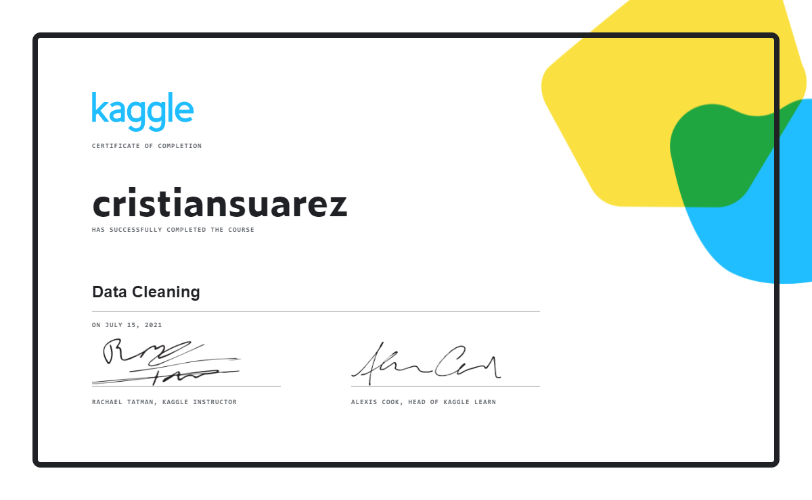

# Data Cleaning

Masterizamos flujos de trabajo eficientes para limpiar datos del mundo real, datos desastrosos.

- [Curso original en kaggle][data-cleaning]
- [Lista de reproducción con las soluciones][youtube-playlist]

1. [Handling Missing Values](./01-handling-missing-values)
2. [Scaling and normalization](./02-scaling-and-normalization)
3. [Parsing dates](./03-parsing-dates)
4. [Character encodings](./04-character-encodings)
5. [Inconsistent data entry](./05-inconsistent-data-entry)

## Certificado

[][certificate]

[Volver atrás](../.)

<!-- LINKS -->
[data-cleaning]:https://www.kaggle.com/learn/data-cleaning
[certificate]:https://www.kaggle.com/learn/certification/cristiansuarez/data-cleaning
[youtube-playlist]:https://youtube.com/playlist?list=PLZh1qmaTeQ-p0z-38SZpJq5lMYoODcMOQ
